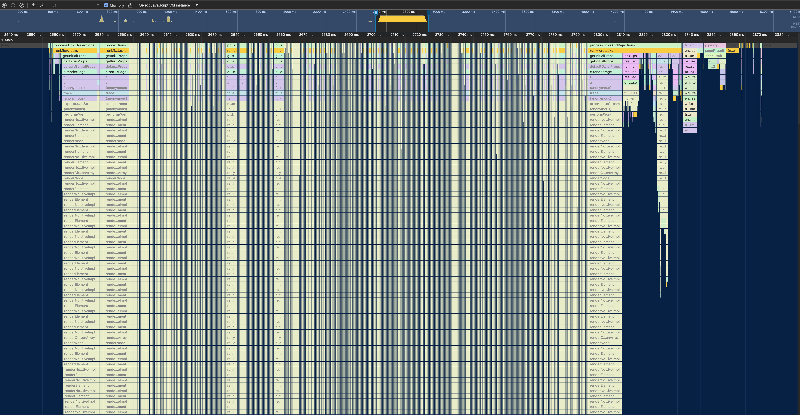
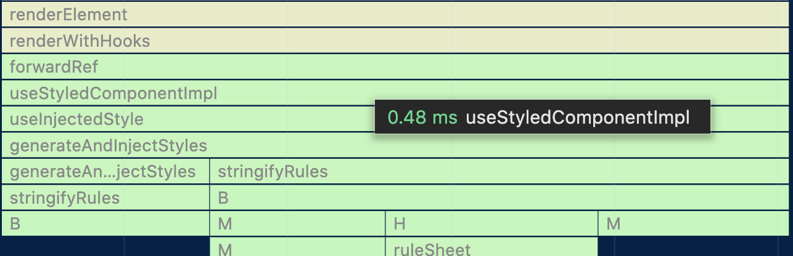
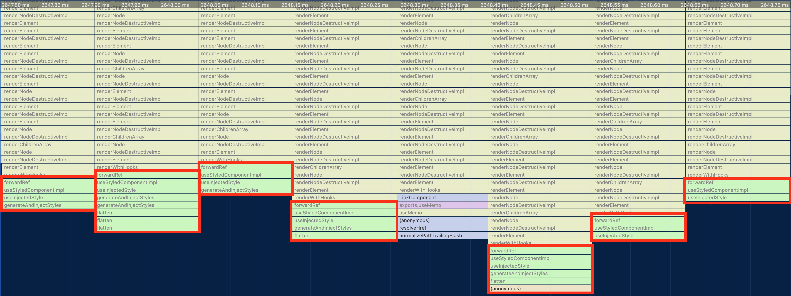
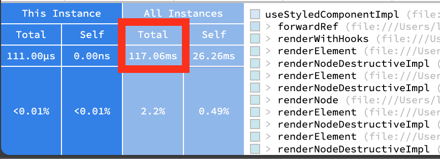

<!---
title: Quantifying the Impact of Styled Components on Server Response Times
description: Working off of a suspicion, I spent some time at work trying to properly attribute the amount of time spent during SSR to Styled Components
socialImage: https://blog.levineandrew.com/img/quantifying-sc-social.jpg
slackLabel1: Reading Time
slackLabel1Value: 4 minutes
slackLabel2: Publish Date
slackLabel2Value: May 20, 2024
-->

# Quantifying the Impact of Styled Components on Server Response Times

For the few years I've worked at my current gig, I've operated under the assumption that Styled Components probably wasn't doing us any favors with regard to runtime performance. Conceptually, having to basically run a miniature compiler (parse/transform/serialize) in N components _during rendering_ does not sound fast.

I recently had some time during a hackweek to explore this idea further and see if I could put some real numbers behind it. I'm sharing my work in hopes that it's helpful to other devs evaluating whether to re-platform their approach to CSS.

## Unminified Styled Components

To start my journey, I went through my typical Node.js profiling routine: start the app w/ `--inspect`, execute some code path a bunch to give the JIT a chance to warm-up, then connect via the Debugging Protocol and capture a CPU trace. Unfortunately, this path wasn't super productive initially because Styled Components only ships _minified_ builds with mangled identifier names to `npm`. This can be observed by browsing the [published artifacts for the package](https://unpkg.com/browse/styled-components@5.3.10/).

If you've ever tried to understanding a CPU trace of minified JavaScript, you likely already know this is a dead end path. So I set out to build my own unminified copy of Styled Components. The path to get this done was roughly:

1. Clone the Styled Components repo from Github
2. `git checkout v5.3.10` to match our app's version
3. Open `package.json`, find the `rollup-plugin-flow` entry, and change `github:probablyup/rollup-plugin-flow#breaking-update-flow-remove-types` to `github:quantizor/rollup-plugin-flow#breaking-update-flow-remove-types` (contributor changed their Github username, dep will 404 without change)
4. Run `yarn` at the root to setup all workspaces
5. Open `packages/styled-components/rollup.config.js` and remove all references to `minifierPlugin` in the various build configs within the file
6. Run `yarn build` in `packages/styled-components`.
7. Unminified copies of the library will be written to `packages/styled-components/dist`

At this point, I was able to go into my app's `node_modules/styled-components/dist` dir and manually update to my new unminified copy.

## Analyzing a Trace

With the boring parts done, we can now capture _useful_ trace data and begin exploring.

### Zoomed Out

Below is a screenshot zoomed in to just the portions of the trace that involve rendering React components. I have excluded the portions of the trace that account for the incoming HTTP request and initial data fetches. We can say that React rendering happened between **2560ms** (when Next.js calls `renderToReadableStream`) and **2810ms** timestamps, so it took roughly **250ms** to render our component tree.

Now that I know how much time the total tree took to render, it's time to isolate what percentage of this work was Styled Components.

### Identify Stacks from Styled Components

To get an aggregate view of the costs of Styled Components, we first need to identify which callstacks in the trace are from the library.

As far as I can tell, the large majority of heavy lifting done by a Styled Component is done during render by the [internal `useStyledComponentImpl` hook](https://github.com/styled-components/styled-components/blob/v5.3.10/packages/styled-components/src/models/StyledComponent.js#L99), as seen in the screenshow below:

Once `useStyledComponentImpl` was identified as the main source of heavy lifting, it started to stand out visually that a decent chunk of time is probably spent rendering these styles

### Collecting Totals

Now that we've identified `useStyledComponentImpl`, we can switch over to [SpeedScope](https://www.speedscope.app/), a really useful CPU Trace viewer with some additional features not present in Chrome DevTools.

In SpeedScope, we can click on a frame in the timeline and get the totals for time spent in that function and its callees across the entirety of the trace.

According to this data, of the roughly **250ms** we spent rendering the component tree, **117ms** of this was spent generating and injecting CSS in Styled Components. This means, assuming my logic is right, _~47% of SSR time was spent generating and injecting css from Styled Components_.

# Conclusion

I feel confident at this point saying "Styled Components _drastically_ decreases the performance of SSR for our React app." Next steps for the day job will include capturing more real Production metrics around the costs of `useStyledComponentImpl` so we can compare the costs under load in a real environment vs on a developer laptop.

It's worth noting that all the takeaways from this post assume all my profiling and testing was sound, which is always a challenge when doing Performance optimization work. Please reach out if you see anything inaccurate in this post that needs adjustment and I'll make the appropriate edits.
